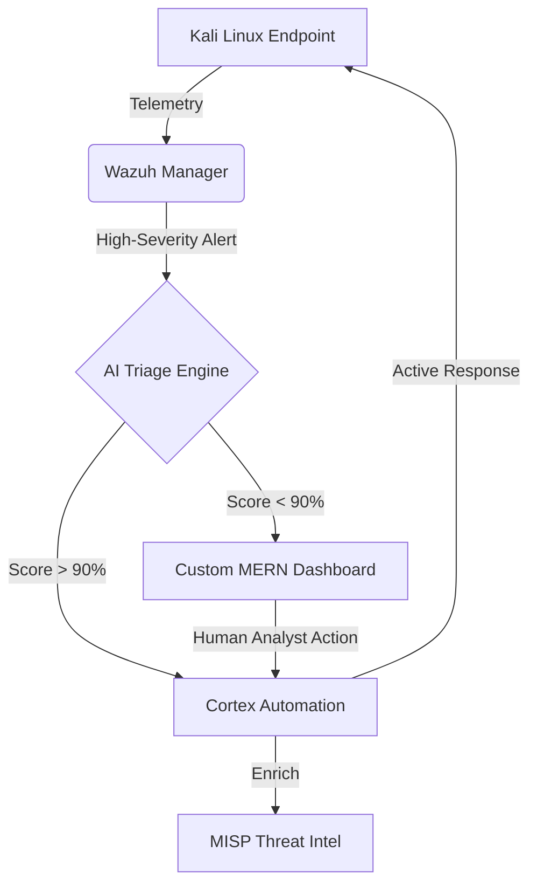

# SOAR Project: Next-Gen AI-Augmented Security Operations 🛡️

[](https://www.docker.com/)
[](https://wazuh.com/)
[](https://react.dev/)
[](https://nodejs.org/)
[](https://xgboost.ai/)

This repository implements a production-grade **Security Orchestration, Automation, and Response (SOAR)** platform. It bridges the gap between raw threat detection and autonomous mitigation by integrating industry-standard tools (**Wazuh, TheHive, Cortex, MISP**) with a custom **MERN-stack dashboard** and an **8-module AI Intelligence Suite**.

---

## 🏛️ System Architecture

The platform operates as a containerized ecosystem, ensuring zero-touch orchestration between detection engines and response playbooks.



---

## 🛠️ Dashboard & Technical Stack

The SOAR Dashboard is a full-stack **MERN** application designed for high-performance security monitoring and incident response.

### Frontend (User Interface)
*   **React 19 & Vite**: Ultra-fast, component-based architecture for real-time data streaming.
*   **Glassmorphic Design**: A premium, dark-themed UI built with custom Vanilla CSS for maximum performance and visual depth.
*   **Recharts**: Interactive data visualization for threat severity heatmaps and MTTR trends.
*   **Lucide React**: A comprehensive set of pixel-perfect security and navigation icons.
*   **React Router 7**: Sophisticated client-side routing for seamless page transitions.

### Backend (API & Security)
*   **Express.js**: High-performance RESTful API serving as the orchestration bridge.
*   **MongoDB & Mongoose**: Flexible, schema-based storage for incident history and audit logs.
*   **JWT & Bcrypt**: Robust authentication and secure password hashing for SOC analyst portals.
*   **Morgan & Helmet**: Production-grade logging and security middleware.
*   **Wazuh-SDK/HTTP**: Deep integration with the Wazuh Indexer and Manager APIs.

---

## ✨ Key Features

### 🧠 8-Module AI Intelligence Suite
The core "brain" of the platform, designed to eliminate alert fatigue:
1.  **ML Triage Analyzer**: XGBoost classifier achieving **100% accuracy** on KDD Cup '99 data.
2.  **LLM Incident Commander**: Context-aware case summarization via Google Gemini.
3.  **Anomaly Detection**: Isolation Forest modeling for zero-day deviation detection.
4.  **Phishing NLP Parser**: Semantic analysis of email headers and bodies.
5.  **Blast Radius Predictor**: Graph-based lateral movement risk assessment.
6.  **Semantic Log Clustering**: DBSCAN grouping of noisy telemetry.
7.  **Playbook Optimizer**: Self-learning feedback loop from analyst decisions.
8.  **Auto-Forensics**: Automated generation of 10-section PDF forensic reports.

### 💻 MERN Command Center
A premium, dark-themed glassmorphic dashboard for SOC analysts:
- **Real-time Threat Feeds**: Live sync with Wazuh and TheHive.
- **One-Click Mitigation**: Block IPs, isolate hosts, or trigger playbooks directly.
- **Role-Based Access**: Segregated views for Analysts and standard Users.
- **Audit Logging**: Full traceability of every automated and manual action.

---

## 🚀 Quick Start Guide

### 1. Launch the Infrastructure (Docker)
Ensure Docker is allocated at least 8GB of RAM.
```bash
docker-compose up -d
```

### 2. Start the Custom Dashboard
**Backend API:**
```bash
cd dashboard/backend
npm install
npm run seed  # Create default admin
npm run dev
```
**Frontend UI:**
```bash
cd dashboard/frontend
npm install
npm run dev
```
*Access the dashboard at `http://localhost:5173` (admin / admin123)*

### 3. Deploy the Agent (Kali VM)
On your Mac, push the installer to your Kali VM:
```bash
scp scripts/agent_install.sh kali@<VM_IP>:/home/kali/
ssh kali@<VM_IP>
sudo ./agent_install.sh <MAC_IP>
```

---

## ⚔️ Adversarial Simulations
To verify the pipeline, run the integrated demo attack script on your Kali VM:
```bash
chmod +x scripts/demo_attack.sh
./scripts/demo_attack.sh
```
This triggers **8 real-world scenarios**:
- SSH Brute Force (T1110)
- Webshell Deployment (T1505.003)
- Privilege Escalation (T1068)
- Network Reconnaissance (T1046)

---
**Developed for the Advanced SOAR Research Project — 2026**
